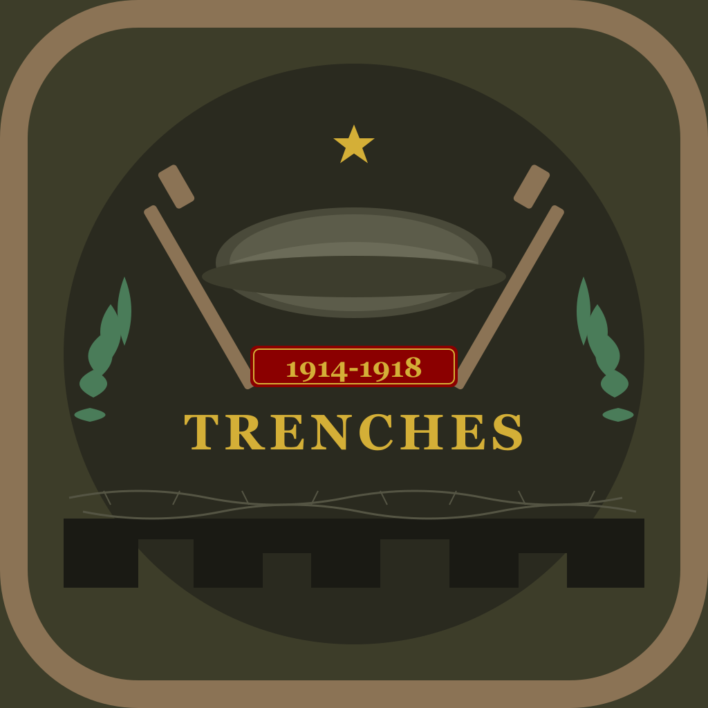

# Trenches: WW1 Tactics

<p align="center">
  
</p>

<p align="center">
  <strong>A turn-based tactical strategy game set in World War I</strong>
</p>

<p align="center">
  Command troops through 20 historically-inspired missions across the Western and Eastern Fronts.
</p>

<p align="center">
  <a href="https://stephenlear.github.io/trenches-ww1-tactics/">Website</a> •
  <a href="https://stephenlear.github.io/trenches-ww1-tactics/support.html">Support</a> •
  <a href="https://stephenlear.github.io/trenches-ww1-tactics/privacy-policy.html">Privacy</a>
</p>

---

## Features

- **Authentic WWI Combat** - Command infantry, machine gunners, snipers, cavalry, and tanks
- **20 Campaign Missions** - Fight at Verdun, the Somme, Vimy Ridge, and more iconic battles
- **4 Playable Nations** - British, French, German, and American forces
- **Supply Line System** - Keep your troops supplied to maintain combat effectiveness
- **Reinforcement System** - Call in reserves mid-battle to turn the tide
- **Dynamic Weather** - Rain, fog, and snow affect battlefield conditions
- **Veteran Soldiers** - Watch your troops gain experience and promotions
- **50+ Achievements** - Track your accomplishments and earn medals
- **Newspaper Headlines** - Read about your victories in period-appropriate newspapers
- **Letters Home** - Personal stories from soldiers at the front

## Screenshots

*Coming soon*

---

## Download

<p align="center">
  <a href="#"></a>
  <a href="#"></a>
</p>

---

## Tech Stack

- **React Native** - Cross-platform mobile framework
- **Expo** - Development and build tooling
- **React Navigation** - Screen navigation
- **AsyncStorage** - Local data persistence

---

## Development

### Prerequisites

- Node.js 18+
- npm or yarn
- Expo CLI

### Installation

```bash
# Clone the repository
git clone https://github.com/StephenLear/trenches-ww1-tactics.git
cd trenches-ww1-tactics

# Install dependencies
npm install

# Start the development server
npx expo start
```

### Building for Production

```bash
# Install EAS CLI
npm install -g eas-cli

# Build for iOS
eas build --platform ios --profile production

# Build for Android
eas build --platform android --profile production
```

---

## Project Structure

```
├── assets/              # App icons, splash screen
├── docs/                # GitHub Pages website
├── src/
│   ├── audio/           # Sound and music
│   ├── components/      # Reusable UI components
│   ├── game/            # Core game logic
│   ├── navigation/      # Navigation setup
│   ├── screens/         # App screens
│   └── utils/           # Utilities
├── app.json             # Expo configuration
└── package.json
```

---

## License

All rights reserved.

---

## Acknowledgments

Dedicated to the memory of all who served in the Great War.

*"Lest We Forget"*

---

<p align="center">
  <sub>Built with ❤️ using React Native and Expo</sub>
</p>
